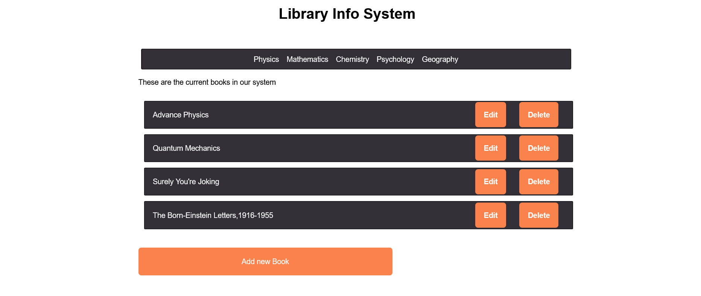

# README

This system allows users to perform CRUD on a book system therefore a user will be able to add new book, list all the books that he/she has, edit a book, or delete it. Moreover, a book is linked to its subject so the user can list all books by their subject.

### Setup

Clone this repository by using the command line :

- `git clone https://github.com/maaloum/Blog_Rails.git`

### Install

Install this project with:

`bundle install`

### Usage

To run the project, execute the following command:

`rails start`

### Test

to run the test, exucute the following command :

`rspec spec`

(<a href="#readme-top">back to top</a>)

<!-- AUTHORS -->

## 👥 Authors 

👤 **Maaloum**

- GitHub: [@githubhandle](https://github.com/maaloum)
- Twitter: [@twitterhandle](https://twitter.com/maaloum)
- LinkedIn: [LinkedIn](https://www.linkedin.com/in/maaloum/)

(<a href="#readme-top">back to top</a>)

